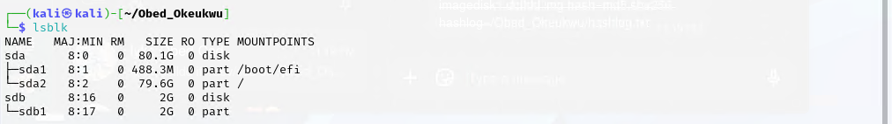
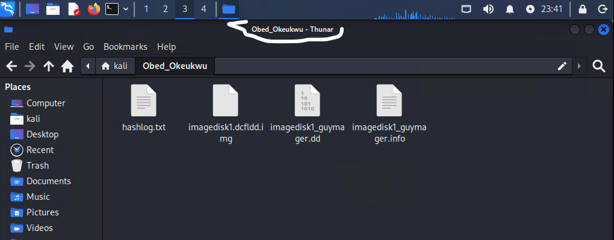
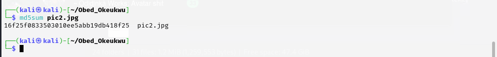
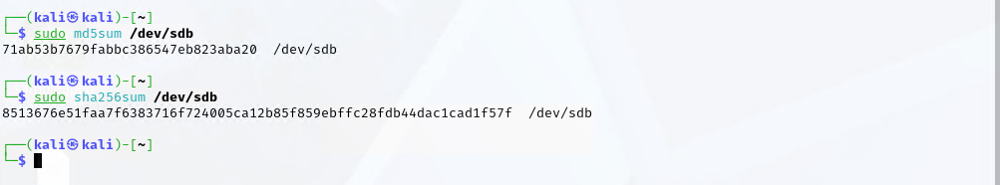
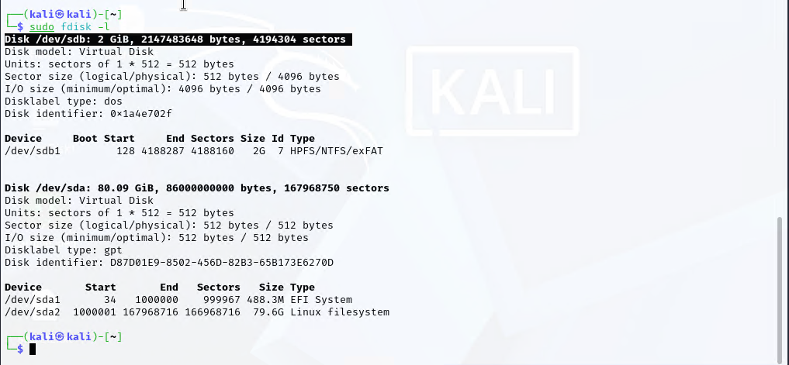
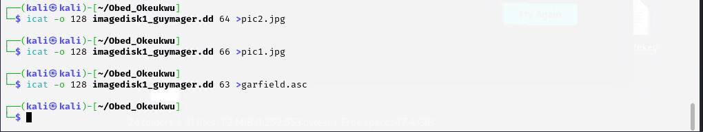
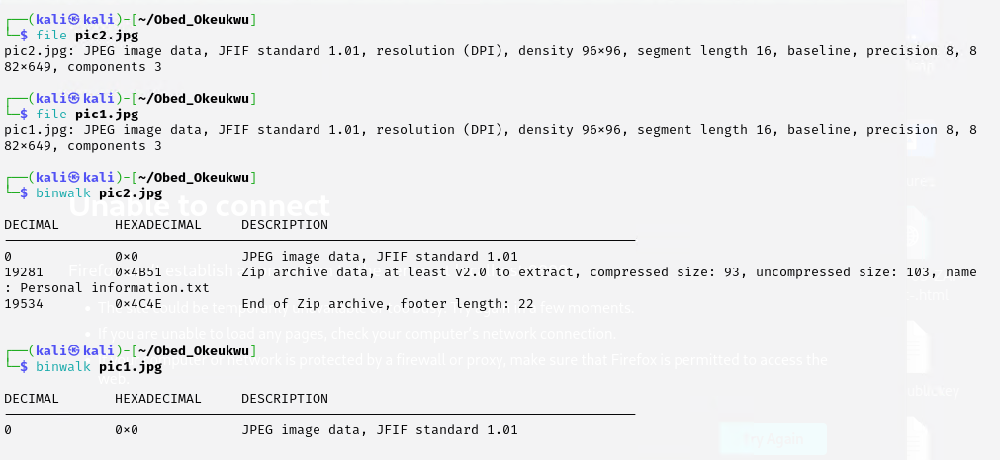
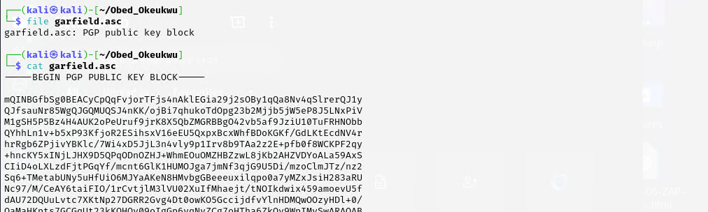
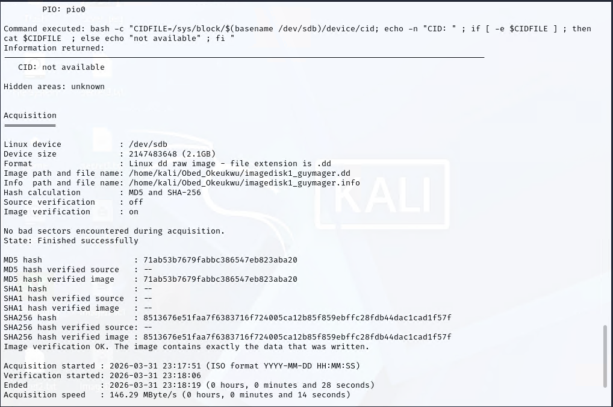

# -Digital-Forensics-Disk-Imaging-and-Analysis-Lab
This project demonstrates a complete digital forensic acquisition and analysis workflow using Kali Linux and forensic tools. A forensic image was acquired from a removable NTFS device, validated using cryptographic hashes, and analyzed for hidden and recoverable artifacts.

The lab follows forensic best practices by preserving evidence integrity through hashing and image verification.

## Objectives

- Identify storage devices for forensic acquisition
- Create a forensic image using Guymager and DCFLDD
- Generate MD5 and SHA-256 hashes
- Verify image integrity
- Analyze disk contents using forensic tools
- Recover files from the forensic image
- Identify hidden artifacts and embedded data
- ## Tools Used

- Kali Linux
- Guymager
- DCFLDD
- MD5SUM
- SHA256SUM
- ICAT
- Binwalk
- Sleuth Kit
- Linux Command Line
- ## Evidence Acquisition

A 2GB NTFS storage device was identified and imaged using Guymager and DCFLDD.

Evidence image:
- imagedisk1_guymager.dd
- imagedisk1.dcfldd.img

Hashes generated:
- MD5
- SHA-256

Image verification confirmed that the acquired image matched the source device.
## Disk Identification
The target storage device was identified using Linux disk utilities.

Device:
- /dev/sdb
- Size: 2 GB
- Filesystem: NTFS
- 
- --
## Integrity Verification

Cryptographic hashing was performed to ensure evidence integrity.

Algorithms:
- MD5
- SHA-256

Verification results confirmed the forensic image was identical to the source media.

## File Recovery

Files were extracted from the forensic image using ICAT.

Recovered artifacts:
- pic1.jpg
- pic2.jpg
- garfield.asc
- 

- ## Hidden Artifact Analysis

Binwalk analysis revealed embedded content inside one of the recovered JPEG files.

Findings:
- Embedded ZIP archive
- Hidden text file
- PGP public key artifact (garfield.asc)

This demonstrates basic forensic artifact discovery and file carving techniques.

## Skills Demonstrated

- Digital Forensics
- Evidence Acquisition
- Disk Imaging
- Chain of Custody Principles
- Hash Verification
- File Recovery
- Artifact Analysis
- Linux Forensics
- Guymager
- DCFLDD
- Binwalk
- Sleuth Kit
